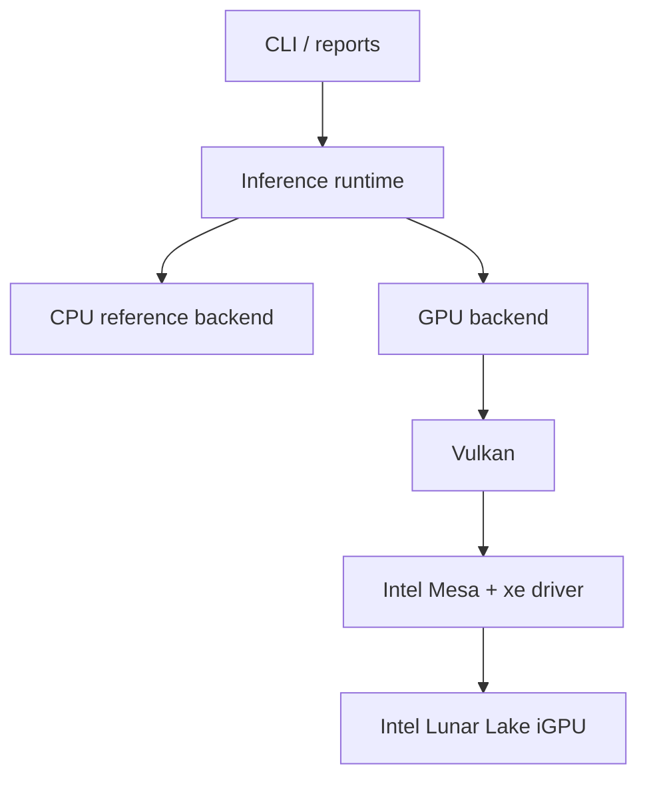

# Jengine

A Rust inference runtime for compact LLMs.

## Current status

Jengine can already run the real **PrismML Ternary-Bonsai-1.7B** model on this machine.

Working today:

- real Bonsai 1.7B weight loading
- real text-prompt CPU generation
- token-id generation path
- prompt analysis and tokenizer diagnostics
- KV-cache and working-set memory estimates
- strict ternary-g128 repacking
- packed tensor serialization
- persistent packed model artifact workflow
- Vulkan dense FP16 matvec baseline
- Vulkan packed ternary matvec baseline
- hybrid decode experiments for `q_proj`, attention-side projection mixes, and `qkv + gu`
- benchmark markdown, key-value, and CSV report generation

## Architecture

Jengine is built in layers:

1. application / CLI
2. inference runtime
3. CPU reference backend
4. GPU backend
5. Vulkan interface



We got correctness first on CPU, then repacked and accelerated selected paths.

## Measured snapshot

### End-to-end CPU runs

| workload | result |
| --- | ---: |
| one-token prompt run | `1513.965 ms` about `0.66 tok/s` |
| short multi-token run | `3418.009 ms` for 3 generated tokens, about `0.88 tok/s` |
| newer post-index-cache one-token sample | `4690.908 ms` total |

### Tensor and kernel baselines

| kernel | result |
| --- | ---: |
| CPU dense `q_proj` matvec `2048x2048` | `3.691 ms` |
| CPU packed reference `q_proj` matvec | `34.492 ms` |
| CPU packed optimized `q_proj` matvec | `19.933 ms` |
| Vulkan dense `q_proj` matvec | `2.519 ms` |
| Vulkan packed `q_proj` matvec | `1.711 ms` |

### Packed artifact results

| metric | result |
| --- | ---: |
| packed entries | `197` |
| packed bytes | `483,755,614` |
| source bytes | `3,440,091,640` |
| reduction | `7.111x` |
| validation max abs diff | `0.000977` |
| manifest load | `0.179 ms` |

### Hybrid decode experiments

| experiment | result |
| --- | ---: |
| cached `q_proj` warm hybrid | `5475.410 ms` |
| broader `qkv + gu` hybrid | `4613.321 ms` |
| broader `qkv + gu` dense comparison | `4410.178 ms` |

Current interpretation:

- CPU packed matvec is now materially better than the earlier packed reference path, but still slower than dense CPU and Vulkan microkernels
- Vulkan packed kernels remain the most promising acceleration direction
- broader hybrid decode still needs lower setup overhead and better reuse to beat the dense path end to end

See also:

- `docs/BASELINES.md`
- `docs/BENCHMARK_CAPTURE_FORMAT.md`
- `docs/PERFORMANCE_TARGETS.md`
- `docs/STATUS.md`
- `docs/VULKAN_PLAN.md`

## CLI

The top-level `jengine` binary exposes subcommands:

```bash
cargo run --release -- inspect [root] [prompt] [max_new_tokens] [--format plain|kv|markdown]
cargo run --release -- run [root] [prompt] [max_new_tokens] [--format plain|kv|markdown]
cargo run --release -- bench [root] [prompt] [max_new_tokens] [iterations] [--format plain|kv|markdown] [--markdown path] [--kv path] [--csv path]
cargo run --release -- profile [root] [prompt] [max_new_tokens] [--format plain|kv|markdown]
cargo run --release -- validate [root] [prompt] [max_new_tokens] [--format plain|kv|markdown]
cargo run --release -- pack [weights_path] [tensor_name] [rows] [cols] [out_path]
```

Default model root:

```text
/home/jeremy/models/bonsai-1.7b
```

### Examples

Inspect model state, tokenizer, weights, memory ownership, and Vulkan availability:

```bash
cargo run --release -- inspect /home/jeremy/models/bonsai-1.7b hello 1 --format plain
```

Run one-token text generation:

```bash
cargo run --release -- run /home/jeremy/models/bonsai-1.7b hello 1 --format kv
```

Run a short benchmark and emit markdown, key-value, and CSV reports:

```bash
cargo run --release -- bench \
  /home/jeremy/models/bonsai-1.7b hello 3 2 \
  --format kv \
  --markdown /tmp/jengine-bench.md \
  --kv /tmp/jengine-bench.kv \
  --csv /tmp/jengine-bench.csv
```

Profile one decode and print per-phase shares:

```bash
cargo run --release -- profile /home/jeremy/models/bonsai-1.7b hello 1 --format plain
```

Validate assets, tokenizer, weights, and a smoke decode:

```bash
cargo run --release -- validate /home/jeremy/models/bonsai-1.7b hello 1 --format markdown
```

Analyze and optionally serialize a packed tensor:

```bash
cargo run --release -- pack \
  /home/jeremy/models/bonsai-1.7b/model.safetensors \
  model.layers.0.self_attn.q_proj.weight \
  2048 2048 /tmp/jengine-qproj.jtpk
```

## Model files and tokenizer behavior

Jengine expects a model root containing at least:

- `config.json`
- `model.safetensors`
- tokenizer assets, either:
  - `tokenizer.json`, or
  - `vocab.json`, `merges.txt`, and `tokenizer_config.json`

Tokenizer loading behavior:

1. try `tokenizer.json`
2. if that fails under the current Rust `tokenizers` crate, fall back to reconstructing a Qwen-style tokenizer from sidecar assets

Detailed notes:

- `docs/TOKENIZER_FALLBACK.md`
- `docs/BONSAI_1_7B.md`

## Current limitations

- end-to-end tok/s is still low on the current CPU reference path
- broader hybrid decode offload still loses to the dense path because setup and reuse costs dominate
- CPU packed matvec is improved but still not competitive with dense CPU or Vulkan packed kernels
- the tokenizer fallback path is currently tuned for the Qwen-style Bonsai release in use here
- the GPU path is still experimental and not yet the default decode backend

## Quality gates

Every milestone is expected to keep these green:

- `cargo fmt --all --check`
- `cargo clippy --workspace --all-targets --all-features -- -D warnings`
- `cargo test --workspace --all-targets`
- `cargo bench --workspace --no-run`

## Repo docs

- `docs/PLAN.md` - execution plan and milestones
- `docs/QUALITY_GATES.md` - required checks for every code chunk
- `docs/BONSAI_1_7B.md` - concrete model notes and constraints
- `docs/BASELINES.md` - measured CPU and runtime baseline numbers
- `docs/BENCHMARK_CAPTURE_FORMAT.md` - stable benchmark capture format
- `docs/RELEASE_BENCHMARK_WORKFLOW.md` - pinned release-mode workflow
- `docs/PERFORMANCE_TARGETS.md` - current performance targets
- `docs/STATUS.md` - current project status and next bottlenecks
- `docs/TOKENIZER_FALLBACK.md` - tokenizer fallback behavior and expected model files
- `docs/AUTOMATION_WORKFLOWS.md` - quick CI, regression, and local profiling scripts
- `docs/BACKEND_REASSESSMENT.md` - why Vulkan still fits and where to narrow the internal boundary
- `docs/PACKED_RUNTIME_ARCHITECTURE.md` - packed-artifact runtime dataflow and ownership model
- `docs/PACKED_RUNTIME_POLICY.md` - LM head and precision decisions for the packed-first runtime
- `docs/PACKED_DECODE_BANDWIDTH.md` - first-order packed Vulkan bandwidth estimates
- `docs/VULKAN_PLAN.md` - Vulkan backend plan based on measured hotspots
